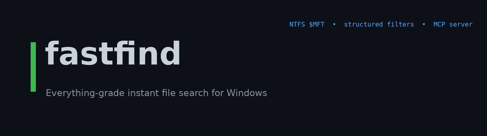
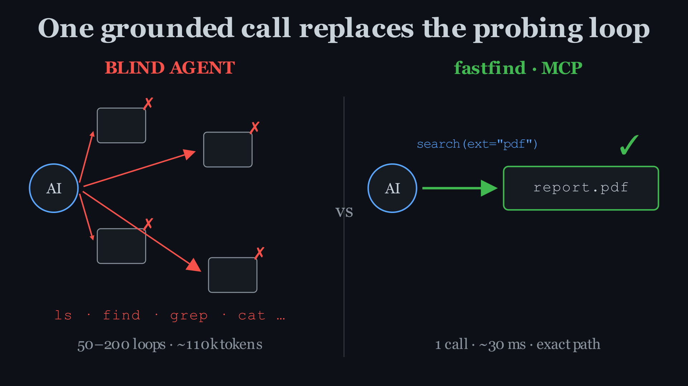
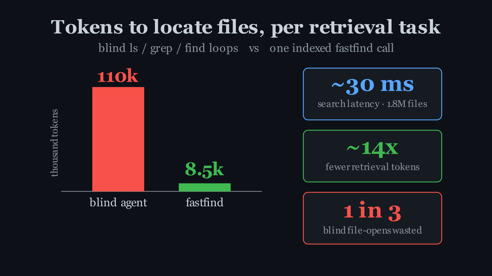
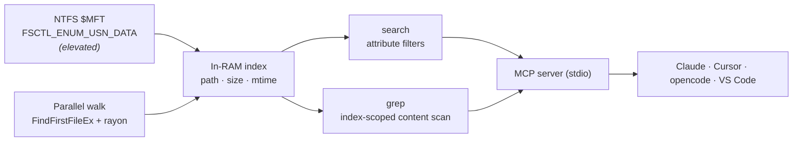

[](LICENSE)


**fastfind is an MCP server that gives AI coding agents instant, grounded access to the filesystem.** It exposes two tools — **`search`** (find files/folders by name, type, size, date) and **`grep`** (find text *inside* files) — both answered from a whole-machine index built off the NTFS Master File Table and kept in RAM. Your agent asks once and gets exact paths and line hits back, instead of guessing and burning tokens on `ls` / `grep` / `find` loops.

---

## Demo


Ask your agent: *"Find every file that imports `numpy` across my machine, grouped by folder."* fastfind's `grep` returns all the hits from its resident index in one call — the same task by hand is dozens of `find` + `grep -r` loops across guessed directories.

---

## The problem it removes



A terminal agent has no map of your disk, so to find anything it loops `ls`, `find`, `grep`, `cat` — parsing errors, re-reading files, chasing paths that don't exist. Published 2025–26 analyses measured the cost:

- **60–98% of a task's tokens** go to filesystem exploration rather than the actual work.
- A grep-only retrieval step burns **~110k input tokens** and **$2–5 per complex query**; indexed retrieval does the same job in **~8.5k tokens** — a **~14× reduction**.
- **65% file precision** — roughly **1 in 3 files an agent opens is wasted**.
- **50–200 navigation loops per session**; one recorded session spent **21,536 tokens just navigating** before its first edit.

fastfind replaces all of that with one grounded call.

---

## Tools

### `search` — files & folders by attribute

Declare intent with structured filters, no path-regex:

```jsonc
{ "ext": ["pdf"], "any_of": ["invoice", "receipt"], "min_size": 50000, "whole_word": true }
```

| Field | Description |
|---|---|
| `query` | Name match; substring by default, `* ?` wildcards, or `regex:true`. Omit to match all and filter below. |
| `ext` | Extensions to include, e.g. `["pdf","docx"]`. |
| `any_of` / `all_of` / `none_of` | OR / AND / NOT terms matched against the full path. |
| `whole_word` | Match those terms only as delimited tokens (`toc`, not `protocol`). |
| `min_size` / `max_size` / `modified_after` | Size (bytes) and date (`YYYY-MM-DD`) bounds. |
| `exclude` / `no_default_ignores` | Add ignores, or turn off the built-ins. |
| `max_results` | Cap results (default 100; `0` = all). |

Each hit returns `{path, name, dir, ext, size, mtime, is_folder}`, plus a `dirs:{path:count}` rollup for instant grouping. **Built-in ignores** (`node_modules`, `.git`, caches, TinyTeX, Steam, hashed cache files) keep results clean out of the box.

### `grep` — text inside files

The filename index selects only the files in scope (`root` / `ext` / path filters), then their contents are read on a wide I/O pool (32 readers by default) — so "where is this used?" is fast without walking the whole disk. Dependency and library trees (`site-packages`, `node_modules`, `.venv`, `__pycache__`, `.git`, `*.egg-info`/`.dist-info`, and the CPython stdlib) are skipped by default so a scan stays first-party and finishes in one call.

```jsonc
// one call → every first-party .py that imports numpy, grouped by folder
{ "pattern": "import numpy", "ext": ["py"], "group_by_dir": true }
```

| Field | Description |
|---|---|
| `pattern` | Text to find; literal by default, or `regex:true`. |
| `root` | Directory to scope the scan to. Omit to scan the whole machine. |
| `ext` / `any_of` / `all_of` / `none_of` | Restrict which files are read. |
| `ignore_case` / `whole_word` | Matching options (case-insensitive by default). |
| `group_by_dir` | Return one compact `by_dir:[{dir,count,files}]` map — ideal for "grouped by folder" in a single call. Implies `files_only`. |
| `files_only` | One entry per matching file (path + first hit) instead of every line — much smaller output. |
| `skip_deps` / `include_deps` | Skip dependency + stdlib trees (default on); set `include_deps:true` to scan them too. |
| `io_threads` | Parallel file readers (default 32); raise on fast SSDs. |
| `time_budget_secs` | Wall-clock ceiling per call (default 22, safe under a 30s MCP timeout). Raise it (and the server's `mcp.json` `timeout`) to finish a fully-cold whole-machine scan in one call. |
| `max_scan_bytes` / `max_file_size` / `max_results` / `per_file_cap` | Read/output caps. |

Line mode returns `{path, dir, name, line_no, line}` per hit; `group_by_dir` returns a `by_dir` map. Every result carries `complete` (was coverage full?), `files_matched`, `candidates`, and `files_scanned`.

**grep in action** — every first-party file importing NumPy across the whole machine, grouped, in one call:

```console
$ fastfind --grep "import numpy" --ext py --group-by-dir
C:\Users\me\Documents\mse\deep-learning\video   (14)
C:\Users\me\Documents\RuView\scripts            (9)
C:\Users\me\AppData\Local\hermes\...\tools      (5)
[grep] 283 files matched (10,679 scanned / 10,679 candidates)
```

The filename index picked the candidate `.py` files instantly; only those were read, dependency/stdlib trees were skipped, and the whole machine was covered in one ~5s call — no full-disk walk, no scoped-retry storm.

---

## Benchmarks



Measured on a low-end **Intel i3-10110U (2c/4t)** over a **~1.8M-file** drive:

- Whole-drive index build: **~21 s** via the `$MFT` (once; then resident in RAM).
- `search` query: **~30 ms** (substring) / **~180 ms** (glob & regex).
- For contrast, Windows' own recursive filename search (`where /r C:\`) **did not finish within 2 minutes** on the same drive.

---

## Install

**One-click:** click the **Install in Cursor** / **Install in VS Code** badges above, or download `fastfind.mcpb` from [Releases](https://github.com/adisingh396/fastfind/releases) and double-click it into Claude Desktop.

**One command** (registers into Claude Desktop, Claude Code, Cursor, opencode and compatible harnesses, with config backups):

```console
fastfind install --apply
```

**Manual** — Claude Desktop / Claude Code / Cursor (`mcpServers`):

```jsonc
{ "mcpServers": { "fastfind": { "command": "C:\\path\\to\\fastfind.exe", "args": ["--mcp"] } } }
```

opencode (`opencode.json`):

```jsonc
{ "mcp": { "fastfind": { "type": "local", "command": ["C:\\path\\to\\fastfind.exe", "--mcp"], "enabled": true } } }
```

Also listed via [`server.json`](server.json) (official MCP registry) and [`smithery.yaml`](smithery.yaml). For the most complete index, run from an elevated shell so it can use the `$MFT` backend.

---

## How it works



- **`$MFT` backend** reads every file record via `FSCTL_ENUM_USN_DATA` and rebuilds paths from parent references — one sequential read instead of millions of directory syscalls (needs elevation).
- **Walk backend** is a `rayon` traversal using `FindFirstFileExW` + `FIND_FIRST_EX_LARGE_FETCH`, capturing size/mtime for free — no admin, any filesystem.
- The index is built once and kept resident; `grep` reuses it to read only in-scope files.

---

## Also a CLI

```console
fastfind --ext pdf --any invoice --min-size 50000          # search
fastfind --grep "import numpy" --root C:/Users/me --ext py # grep contents
fastfind --any toc --whole-word                            # token match, not "protocol"
fastfind "*.log" --json                                    # machine-readable
```

## Build from source

Needs a [Rust toolchain](https://rustup.rs) (Windows):

```console
git clone https://github.com/adisingh396/fastfind
cd fastfind
cargo build --release   # -> target\release\fastfind.exe
```

Package the Claude Desktop extension with `npx @anthropic-ai/mcpb pack` (uses `manifest.json`).

## Roadmap

- [ ] Live index updates via the `$USN` change journal
- [ ] Prebuilt release binaries + signed `.mcpb`
- [ ] macOS / Linux backends
- [ ] Ranked `grep` output with surrounding context lines

## Contributing

Issues and PRs welcome. Run `cargo fmt` / `cargo clippy` and note what you verified.

## License

[MIT](LICENSE) © Aditya Singh

<sub>Cost figures above are ranges reported by public 2025–26 analyses of coding-agent filesystem use (ContextBench, Semble, Hypergrep, and agent session logs). Latency figures are from this project's own runs.</sub>
