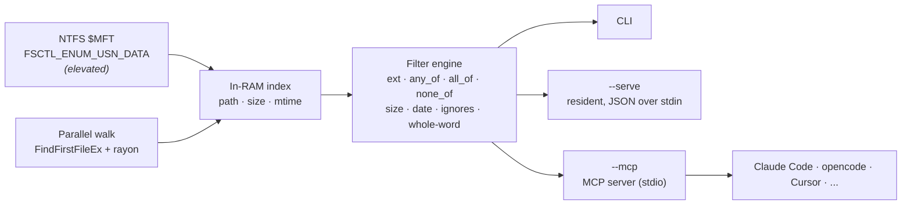

# fastfind


[](LICENSE)


**Instant, whole-machine file & folder search for Windows** — the speed of [Everything](https://www.voidtools.com/) built straight into a single self-contained binary, with **structured filters** (no path-regex gymnastics) and a built-in **[MCP](https://modelcontextprotocol.io) server** so your AI coding agents can search the disk in milliseconds.

```console
$ fastfind --ext pdf --any invoice --min-size 50000 -n 3
C:\Users\me\Documents\billing\invoice-2026-08.pdf
C:\Users\me\Downloads\acme_invoice.pdf
C:\Users\me\work\clients\invoice-final.pdf
[mft] 3 shown / 27 total (0 folders, 27 files)
```

---

## Why fastfind

Windows file search is slow because it crawls directories. fastfind doesn't. It reads the **NTFS Master File Table (`$MFT`)** directly — the same technique Everything uses — to build a full-drive index in seconds, keeps it in RAM, and answers queries with a parallel scan. When it can't read the raw volume (no admin), it falls back to a **multi-threaded directory walk** that's still far faster than a naive `scandir`.

On top of raw speed, fastfind removes the busywork most search tools push onto you:

- **Built-in ignore rules** kill the noise (`node_modules`, `.git`, caches, TinyTeX, Steam, hashed cache files) so a `*.pdf` search doesn't drown in build artifacts.
- **Structured filters** — `ext`, `any_of` (OR), `all_of` (AND), `none_of` (NOT), `min_size`/`max_size`, `modified_after` — express intent directly instead of hand-rolling regex.
- **Structured JSON output** with a `dirs: {path: count}` rollup, so grouping and dedup are trivial and deterministic.

---

## Benchmarks


Measured on a low-end **Intel i3-10110U (2c/4t)** laptop against a **~1.8M-file** `C:` drive.

| Operation | Baseline (Python) | fastfind | Speedup |
|---|---|---|---|
| Full-drive index build | 109 s (`os.scandir`) | **21 s** (`$MFT`) | **5.2×** |
| Single query, resident index | 1300 ms (linear scan) | **30 ms** (substring) | **43×** |
| `*.pdf` result noise | 1511 raw hits | **49** (ext + keyword) | **31× less noise** |
| Token match `toc` | 10,324 substring hits | **588** whole-word | 9,736 false hits removed |

> The `$MFT` backend needs an elevated shell to open the raw volume. Without elevation, fastfind uses the parallel walk and everything else works identically.

---

## Architecture



The index is built **once**. `--serve` and `--mcp` keep it resident so every subsequent query is answered from RAM — build cost amortises to zero, exactly like the Everything service.

---

## Install

**Prerequisites:** a [Rust toolchain](https://rustup.rs) (Windows). Then:

```console
git clone https://github.com/adisingh396/fastfind
cd fastfind
cargo build --release
```

The binary lands at `target\release\fastfind.exe`. Copy it anywhere on your `PATH` (e.g. `%LOCALAPPDATA%\Programs\fastfind\`).

For the fastest, most complete index, run it from an **Administrator** terminal so it can use the `$MFT` backend.

---

## Usage

### Command line

```console
# name search (substring by default), whole machine
fastfind report

# extension + keyword filters — no regex needed
fastfind --ext pdf --any invoice --any receipt

# AND / NOT / size / date
fastfind --ext docx --all 2026 --all contract --none draft --min-size 20000 --after 2026-01-01

# match a term only as a whole token ("toc" but not "protocol"/"CGMWTOCT")
fastfind --any toc --whole-word

# wildcards, regex, path matching
fastfind "*.log" --path
fastfind "^build_\d+\.sh$" --regex

# machine-readable output for scripts
fastfind --ext pdf --any invoice --json
fastfind "*.dll" --count

# choose a backend / scope explicitly
fastfind "*.rs" --walk --root C:/Users/me/projects
fastfind "*.rs" --mft            # requires an elevated shell
fastfind report --refresh        # rebuild the index
```

Every result carries `{path, name, dir, ext, size, mtime, is_folder}`, and JSON output includes a `dirs` rollup:

```jsonc
{
  "backend": "mft",
  "total": 49,
  "count": 3,
  "dirs": { "C:\\Users\\me\\Documents\\billing": 12, "C:\\Users\\me\\Downloads": 5 },
  "results": [
    { "path": "C:\\Users\\me\\Documents\\billing\\invoice-2026-08.pdf",
      "name": "invoice-2026-08.pdf", "dir": "C:\\Users\\me\\Documents\\billing",
      "ext": "pdf", "size": 68344, "mtime": 1790155752, "is_folder": false }
  ]
}
```

### Resident server

Build once, then stream JSON requests (one per line) and get JSON responses back:

```console
fastfind --serve
```

```jsonc
> {"ext":["pdf"],"any_of":["invoice"],"max_results":5}
{"backend":"mft","total":27,"count":5,"results":[...],"dirs":{...}}
```

---

## Use it from an AI agent (MCP)

fastfind speaks the **Model Context Protocol** over stdio, exposing a single `search` tool with the full filter set. Register it in one command:

```console
fastfind install --apply
```

This detects installed agents (Claude Desktop, Claude Code, Cursor, opencode, and compatible harnesses) and adds a `fastfind` MCP server entry, backing up any existing config. Dry-run first with plain `fastfind install`, or target one with `--agent opencode`.

Or add it by hand. **Claude Desktop / Claude Code / Cursor** (`mcpServers`):

```jsonc
{
  "mcpServers": {
    "fastfind": { "command": "C:\\path\\to\\fastfind.exe", "args": ["--mcp"] }
  }
}
```

**opencode** (`opencode.json`):

```jsonc
{
  "mcp": {
    "fastfind": {
      "type": "local",
      "command": ["C:\\path\\to\\fastfind.exe", "--mcp"],
      "enabled": true
    }
  }
}
```

The agent then calls `search` with structured arguments:

```jsonc
{ "ext": ["pdf"], "any_of": ["thesis", "report"], "min_size": 100000, "whole_word": true }
```

### `search` tool parameters

| Field | Type | Description |
|---|---|---|
| `query` | string | Name match. Substring by default; `* ?` wildcards; regex with `regex:true`. Omit to match everything and filter with the fields below. |
| `ext` | string[] | Extensions to include, e.g. `["pdf","docx"]`. |
| `any_of` / `all_of` / `none_of` | string[] | OR / AND / NOT terms matched against the full path. |
| `whole_word` | bool | Match `any_of`/`all_of`/`none_of` terms only as delimited tokens. |
| `min_size` / `max_size` | int | File size bounds in bytes. |
| `modified_after` | string | `YYYY-MM-DD` or unix seconds. |
| `exclude` | string[] | Extra path substrings to ignore. |
| `no_default_ignores` | bool | Disable the built-in ignore rules. |
| `match_path` | bool | Match `query` against the full path, not just the file name. |
| `max_results` | int | Cap results (default 100; `0` = all). `total`/`dirs` always reflect the full match count. |

---

## How it works

- **`$MFT` backend** — opens `\\.\C:` and enumerates every file record via `FSCTL_ENUM_USN_DATA`, reconstructing full paths from parent file references. One large sequential read instead of millions of directory syscalls. Requires Administrator.
- **Walk backend** — a `rayon` work-stealing traversal using `FindFirstFileExW` with `FindExInfoBasic` + `FIND_FIRST_EX_LARGE_FETCH`, capturing size and modified-time for free. No admin, works on any filesystem.
- **Index** — a flat, in-RAM list of `{path, size, mtime}` with lowercased paths for allocation-free case-insensitive matching. Persisted to a compact cache in `%TEMP%` so cold one-shot runs skip the rebuild.
- **Filtering** — cheap predicates (name/ext/ignores/terms) run first in parallel; size/date predicates run only on survivors, lazily `stat`-ing when the backend didn't already have the metadata.

Dependencies: [`rayon`](https://crates.io/crates/rayon), [`regex`](https://crates.io/crates/regex), [`rustc-hash`](https://crates.io/crates/rustc-hash), [`serde_json`](https://crates.io/crates/serde_json). No unsafe beyond the thin Win32 FFI layer.

---

## fastfind vs. Everything

|  | fastfind | Everything |
|---|---|---|
| Full-drive `$MFT` index | ✅ | ✅ |
| Live `$UsnJrnl` updates | ⏳ planned | ✅ |
| Single self-contained binary | ✅ | ✅ |
| Structured filters (ext/AND/OR/NOT/size/date) | ✅ | partial (query syntax) |
| Built-in noise ignores | ✅ | ✗ |
| JSON output + dir rollup | ✅ | HTTP/ETP only |
| Native MCP server for agents | ✅ | ✗ |
| Cross-filesystem fallback (no admin) | ✅ | ✗ |

fastfind isn't trying to replace Everything's GUI — it's the piece you script and wire into tools.

---

## Roadmap

- [ ] Live index updates via the `$USN` change journal.
- [ ] All hard-link paths for `$MFT` entries.
- [ ] `size:`/`dm:`-style query sugar.
- [ ] Prebuilt release binaries.

---

## Contributing

Issues and PRs welcome. Keep changes focused, run `cargo fmt` and `cargo clippy`, and include a short note on what you verified.

## License

[MIT](LICENSE) © Aditya Singh

---

### Troubleshooting

- **`error: only metadata stub found for rlib dependency core`** on some `windows-gnu` toolchains — build with `set RUSTC_BOOTSTRAP=1 && set RUSTFLAGS=-Zembed-metadata=yes && cargo build --release`, or use the `windows-msvc` toolchain.
- **`access denied opening C:`** — the `$MFT` backend needs an elevated terminal; otherwise fastfind uses the walk backend automatically.
