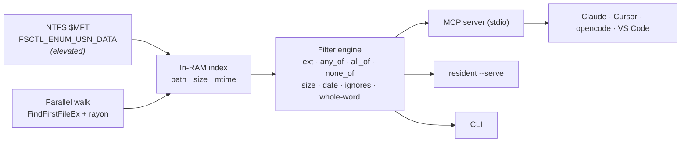

[](LICENSE)


[](cursor://anysphere.cursor-deeplink/mcp/install?name=fastfind&config=eyJjb21tYW5kIjogImZhc3RmaW5kIiwgImFyZ3MiOiBbIi0tbWNwIl19)
[](vscode:mcp/install?%7B%22name%22%3A%22fastfind%22%2C%22command%22%3A%22fastfind%22%2C%22args%22%3A%5B%22--mcp%22%5D%7D)

**fastfind is an MCP server that gives AI coding agents instant, grounded file discovery.** One `search` call returns the exact full paths — plus size, modified-time, and a per-directory rollup — from a whole-machine index built off the NTFS Master File Table and kept in RAM. So your agent stops guessing paths and burning tokens on `ls` / `grep` / `find` spelunking.

---

## The problem: blind agents pay a "search tax"


Terminal agents (Claude Code, Cursor, Codex, …) have no map of your disk. To find a file they loop `ls`, `find`, `grep`, `cat` — parsing `stderr`, re-reading files, chasing hallucinated paths. Independent 2025–26 analyses put hard numbers on it:

- **60–98% of tokens** on a retrieval task go to raw filesystem exploration, not the actual work. <sup>[1][2][3]</sup>
- A grep-only retrieval step burns **~108k–117k input tokens** and **$2–5 per complex query**; structured/indexed retrieval does the same job in **~8.5k tokens — a ~14× reduction**. <sup>[2]</sup>
- **65% file precision** — roughly **1 in 3 files an agent opens is wasted**. <sup>[4]</sup>
- **50–200 navigation loops per session**; one recorded session spent **21,536 tokens just navigating** before its first edit. <sup>[1][3]</sup>

fastfind removes the tax: the agent declares intent once and gets back exactly the files that match.

---

## What it does


| | Blind agent (`ls` · `grep` · `find`) | fastfind (MCP) |
|---|---|---|
| Calls to locate a file | 50–200 probe loops | **1 `search` call** |
| Retrieval tokens | ~110k / task | **~14× fewer** |
| Precision | 65% (1 in 3 wasted) | **exact paths only** |
| Latency | seconds of loops | **~30 ms** |
| Returns | raw stdout to re-parse | **path · size · mtime · dir rollup** |

Latency measured on a low-end **Intel i3-10110U (2c/4t)** over a **~1.8M-file** drive: a resident-index query returns in **~30 ms** (substring) / **~180 ms** (glob & regex). For contrast, Windows' own recursive filename search (`where /r C:\`) **did not finish within 2 minutes** on the same drive — a full-drive scan is not a usable interactive path. fastfind builds its index once (**~21 s** via the `$MFT`) and answers everything after from RAM.

---

## Install

### One-click / one-command

- **Cursor** — click the *Install in Cursor* badge above.
- **VS Code** — click the *Install in VS Code* badge above.
- **Claude Desktop** — download `fastfind.mcpb` from [Releases](https://github.com/adisingh396/fastfind/releases) and double-click it (Settings → Extensions).
- **Everything else** — grab `fastfind.exe` from Releases (or build below), then run:

  ```console
  fastfind install --apply
  ```

  This detects Claude Desktop, Claude Code, Cursor, opencode and compatible harnesses and registers the `fastfind` MCP server, backing up existing configs. Dry-run with `fastfind install`; target one with `--agent opencode`.

### Manual config

**Claude Desktop / Claude Code / Cursor** (`mcpServers`):

```jsonc
{ "mcpServers": { "fastfind": { "command": "C:\\path\\to\\fastfind.exe", "args": ["--mcp"] } } }
```

**opencode** (`opencode.json`):

```jsonc
{ "mcp": { "fastfind": { "type": "local", "command": ["C:\\path\\to\\fastfind.exe", "--mcp"], "enabled": true } } }
```

Listed on the [official MCP registry](server.json) and [Smithery](smithery.yaml).

---

## The `search` tool

Declare intent with structured filters — no path-regex gymnastics:

```jsonc
{ "ext": ["pdf"], "any_of": ["invoice", "receipt"], "min_size": 50000, "whole_word": true }
```

| Field | Type | Description |
|---|---|---|
| `query` | string | Name match. Substring by default; `* ?` wildcards; regex with `regex:true`. Omit to match everything, then filter below. |
| `ext` | string[] | Extensions to include, e.g. `["pdf","docx"]`. |
| `any_of` / `all_of` / `none_of` | string[] | OR / AND / NOT terms matched against the full path. |
| `whole_word` | bool | Match those terms only as delimited tokens (`toc` matches `\toc\`, not `protocol`). |
| `min_size` / `max_size` | int | File-size bounds in bytes. |
| `modified_after` | string | `YYYY-MM-DD` or unix seconds. |
| `exclude` / `no_default_ignores` | string[] / bool | Extra ignores, or disable the built-ins. |
| `match_path` | bool | Match `query` against the full path. |
| `max_results` | int | Cap results (default 100; `0` = all). `total`/`dirs` always reflect the full match count. |

Response — every hit carries structured fields, plus a directory rollup for instant grouping:

```jsonc
{
  "total": 49, "count": 3,
  "dirs": { "C:\\Users\\me\\Documents\\billing": 12, "C:\\Users\\me\\Downloads": 5 },
  "results": [
    { "path": "C:\\Users\\me\\Documents\\billing\\invoice-2026-08.pdf", "name": "invoice-2026-08.pdf",
      "dir": "C:\\Users\\me\\Documents\\billing", "ext": "pdf", "size": 68344, "mtime": 1790155752, "is_folder": false }
  ]
}
```

**Built-in noise filters** are on by default (`node_modules`, `.git`, caches, TinyTeX, Steam, hashed cache files), so a `*.pdf` search doesn't drown in build artifacts — on the test drive that trimmed a raw `*.pdf` result from **1511 → 49** relevant hits.

---

## Architecture



- **`$MFT` backend** reads every file record via `FSCTL_ENUM_USN_DATA` and rebuilds paths from parent references — one sequential read instead of millions of directory syscalls (needs an elevated shell).
- **Walk backend** is a `rayon` traversal using `FindFirstFileExW` + `FIND_FIRST_EX_LARGE_FETCH`, capturing size/mtime for free — no admin, any filesystem.
- The index is built once and kept resident; queries run as a parallel scan with cheap predicates first and size/date checks only on survivors.

---

## Also a CLI

The same engine ships as a standalone command:

```console
fastfind --ext pdf --any invoice --min-size 50000        # structured filters
fastfind --any toc --whole-word                          # token match, not "protocol"
fastfind "*.log" --json                                  # machine-readable
fastfind report --mft                                    # $MFT backend (elevated)
```

---

## Build from source

Needs a [Rust toolchain](https://rustup.rs) (Windows):

```console
git clone https://github.com/adisingh396/fastfind
cd fastfind
cargo build --release   # -> target\release\fastfind.exe
```

Package the Claude Desktop extension with `npx @anthropic-ai/mcpb pack` (uses `manifest.json`).

---

## Roadmap

- [ ] Live index updates via the `$USN` change journal
- [ ] Prebuilt release binaries + signed `.mcpb`
- [ ] macOS / Linux backends
- [ ] `size:` / `modified:` query sugar

## Contributing

Issues and PRs welcome. Run `cargo fmt` / `cargo clippy` and note what you verified.

## License

[MIT](LICENSE) © Aditya Singh

---

<sub>Sources: [1] ContextBench / J. Nesler; [2] Semble case study & Hypergrep analysis; [3] developer session logs; [4] semantic code-retrieval precision tracking (Claude Code) — public analyses, 2025–26. Figures are third-party reported ranges; latency figures marked "measured" are from this project's own runs.</sub>
